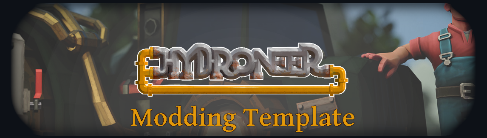

## 
It is important that you read this guide so you know which template to download!

### 
Brought to you by: The RFC Mining Company

 

Before you begin modding you will need to download and install the following required programs:
- Unreal Editor v4.26.2
- Microsoft Visual Studio 2019
- [Hydroneer Modding Toolchain](https://github.com/ResaloliPT/HydroModTool) by ResaloliPT, for easy mod pak'ing.
- (Optional) [UEViewer (aka "umodel")](https://www.gildor.org/en/projects/umodel#files) by Gildor, for extracting assets.
- (Optional) [Asset Editor](https://github.com/kaiheilos/Utilities) by KaiHeilos, or a similar program capable of viewing uasset files.
- (Optional) [UAssetGUI](https://github.com/atenfyr/UAssetGUI/releases) by atenfyr, or a similar program capable of viewing uasset files.

Multiple asset viewers are recommended. Where one fails another may work.

## Step 1: Picking a Template

The [Master](https://github.com/RFC-MiningCompany/HydroneerTemplate/tree/master) branch contains the basic template with the smallest overall file size. ResaloliPT has packed this one with the core functionality and none of the fluff. The missing items are not critical and those you need can be pulled in or created on an as needed basis for your mod. If you're not planning to work with lots of in game meshes and textures, this is the template you want.

The [Full Template](https://github.com/RFC-MiningCompany/HydroneerTemplate/tree/fullTemplate) contains nearly everything. Meshes, textures, materials, plus everything in the Master branch. It has a **very** large overall file size, but allows you to work with items in the viewport as they appear in the game with no additional work on your part. This is incredibly useful for working with retail items, and it looks awesome.  (And, please, thank F4t4l for this one) (Seriously, thank him, like, at least four times. This was a huge task, and Cheebsta made him do it twice.)

While this is downloading, proceed to Step 2.

## Step 2: Setup Visual Studio 2019

Setting up a Visual Studio environment can be a pain in the butt. Again, ResaloliPT has come to the rescue with a Visual Studio 2019 Config (Found in the /Extras/ folder of your template files) file we can use to jump start this part of the process.

As a temporary measure you will need to paste the contents of the config file found in the Extras folder into a text file on your computer. Name it .vsconfig, save, and proceed with the steps below.
  
Run the Visual Studio Installer by searching for it in Windows: 
 

Select "Import Config" for the "More" dropdown menu: 
 

Navigate to the Extras folder of your template (Choose \*.* in the dropdown): 
 

Proceed to details: 
 

Select Install Option: 
 

## Step 3: Building the C++

Inside either template you will find an Unreal Engine (v4.26) project file. Right click this file, if Visual Studio 2019 is installed properly you should see an option to "Generate Visual Studio Project Files". Select it. When the process completes a new file, "Mining.sln", should appear in the same folder. Open this file, look on the right side, and again right click "Solution xyz", this time selecting "Build Solution", as seen below:

## Step 4: Open your Unreal modding project
Now that the C++ is built you can open the Mining.uproject file. If it asks about rebuilding, select "Yes". An empty scene will appear and the content browser will be populated. In the lower right corner you should see a message about "Compiling Shaders". It is best to wait for this to complete before having a look around. Please be aware that it may take a little while if you downloaded the full template. 

Most folders have obvious names.

Item blueprints are found within the WorldObj folder.

Textures, Materials, and Meshes are only included in the Full Template. If you have the Master template you can simply create these folders and add files as needed.

**Note**: The first time you "Cook Content for Windows" it *will* take a long time. This is normal. Do not be alarmed.

## Step 5: Start Modding!

The simplest of mods, such as texture replacements, just need files with the correct name in the correct location. Most other mods will need a little help getting into the game world. To facilitate this ResaloliPT has created the Hydroneer Mod Loader, or HML for short. This handy system lives within the HML folder of your project, and lets modders easily load their custom items into the game all without worry of writing over each other. To begin using it navigate to the HML/Hooks folder and create a new blueprint using the WorkshopMod class. The class defaults can be set up on the right (See Image Below). 

 - *Order* does not need to be changed for most mods. 
 - *Name* is the display name used for the mod.
 - *HookName* must match the name of your hook file.
 - *ModType* does not need to be changed.

Once your hook is created, if you have not already, create a "Mods" folder in the main Content directory of your project. In the "Mods" folder make another folder for your mod. Here is where you will want to keep all of your files, using your hook as their way into the game.

## Step 6: Testing your Mod
Using the [Hydroneer Modding Toolchain](https://github.com/ResaloliPT/HydroModTool) by ResaloliPT greatly simplifies the mod testing and preparation process.

Clicking on "Add Project" in the "Create Mods" section will present you with the following dialogue.

- *Project Name* should match the name of your hook file. You should not add the BP_ at the beginning of the name.
- *Mod Index* will remain 500 for most mods. 
- *Cooked Assets* points to the Mining folder inside your template Saved/Cooked directory
- *Output Dir* is the location your created pak file will be stored.

After setting up the project, right click to add assets. First select "Yes" in the dialogue and navigate to your hook file. Select both the .uasset and .uexp files. Right click again, select add, but this time pick "No" and select your mod folder.

To test your mod pick "Dev Express". This will get everything ready and launch you straight into the game using the legacy modding system. Test your mod thoroughly before releasing to the workshop. You can always share your mod with the #modding channel of the Hydroneer Discord for further testing as well. It is a very helpful community.

## Step 7: It's time for the Workshop!

You'll need to make a thumbnail for your mod, under 1MB in size. It can be jpg or png. 640x320 looks decent in the Steam Library (you can add more images of higher quality directly through Steam later). Put this image somewhere easy to find. You can put it into the folder we will make in the next step, but if you do it *must* be named "thumbnail". If it has any other name the image file, along with a copy called "thumbnail" will get downloaded by everyone who installs your mod.

Open Windows File Explorer and head over to the folder you set as your Output Dir in the Modding Toolchain. Inside the "dist" folder you will find the most recent copy of your mod file. Make a new folder with the name of your mod and drop the mod file inside.

Run Hydroneer, pick Mods and Upload Mod. Fill out the required information. **Do not use spaces in your mod title.** Mod ID is only needed when updating an existing mod. **Make sure you select a Visibility setting**.

  
## You've published a mod!

Return to the Hydroneer Modding Toolchain and select "Clear Mods" before subscribing to your Workshop mod. This will remove **all** mods from the legacy mods folder and make sure no conflicts occur with two versions of the same mod installed.

  

## If you have problems/fixes:

Direct questions to the #modding channel of the Hydroneer Discord. Someone is usually around to help.

If you've already done some fixes you can add them to a push request for the development branch. Once verified they will be added to the other branches as needed.

### RFC Mining Company Members:
 - ResaloliPT [2.0 Releases Link Coming Soon]()
   - Code References
   - Hydroneer Mod Loader
   - Hydroneer Modding Toolchain
   - Backend Guru
 - F4t4l [2.0 Releases Link Coming Soon]()
   - Mesh & Texture Export
   - Mesh & Texture Import
   - Material Creation & Linking
   - FX Wizard
 - Cheebsta [2.0 Releases Link Coming Soon]()
   - Template Stub Generator
   - Asset Location Verification
   - readme Author
   - Math Nerd
